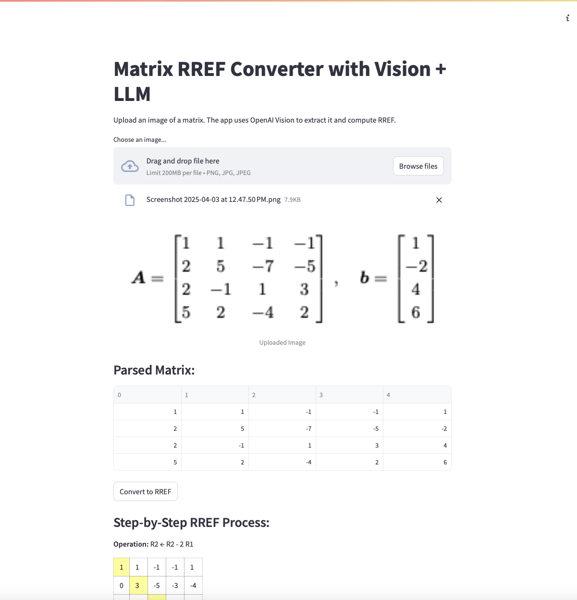
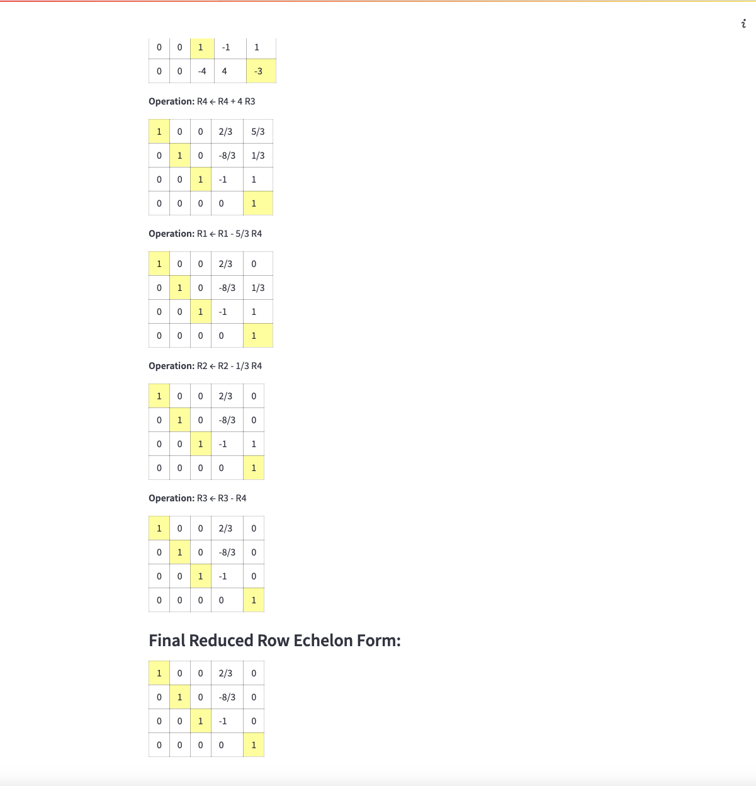

# Matrix RREF

A Streamlit web app that computes the **Reduced Row Echelon Form (RREF)** of a matrix from an image. Powered by OpenAI Vision.

## Features

- Upload images of matrices (handwritten or printed)
- Automatically detects and extracts matrix data using GPT-4 Vision
- Converts to RREF with step-by-step transformations
- Displays matrices with fraction formatting and pivot highlights

## Setup
```bash
git clone https://github.com/your-username/matrix-rref.git
cd matrix-rref
python3 -m venv .venv
source .venv/bin/activate  # or .venv\Scripts\activate on Windows
pip install -r requirements.txt
```
Create a .env file in the root directory:
```
OPENAI_API_KEY=sk-...
```

## Run
```bash
streamlit run app.py
```
The app will be available at http://localhost:8501.



